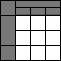

 

[Web Accessibility Tutorials Guidance on how to create websites that meet WCAG](../)

<a href="#nav" class="btn btn-jump">Jump to the navigation</a>

[Tutorials home](../) »  Current: Tables » Current: Tables Concepts 

Tables Concepts
===============

**Technologies covered in this Tutorial:**

HTML4 HTML5 WAI-ARIA

Data tables are used to organize data with a logical relationship in grids. Accessible tables need HTML markup that indicates header cells and data cells and defines their relationship. Assistive technologies use this information to provide context to users.

Header cells must be marked up with `<th>`, and data cells with `<td>` to make tables accessible. For more complex tables, explicit associations may be needed using `scope`, `id`, and `headers` attributes.

This tutorial shows you how to apply appropriate structural markup to tables. It includes the following pages:

-   **[Tables with one header](one-header/)** for rows or columns: For tables with content that is easy to distinguish, mark up header cells with `<th>` and data cells with `<td>` elements.

-   **[Tables with two headers](two-headers/)** have a simple row header and a simple column header: For tables with unclear header directions, define the direction of each header by setting the `scope` attribute to `col` or `row`.

-   **[Tables with irregular headers](irregular/)** have header cells that span multiple columns and/or rows: For these tables, define column and row groups and set the range of the header cells using the `colgroup` and `rowgroup` values of the scope attribute.

-   **[Tables with multi-level headers](multi-level/)** have multiple header cells associated per data cell: For tables that are so complex that header cells can’t be associated in a strictly horizontal or vertical way, use `id` and `headers` attributes to associate header and data cells explicitly.

-   **[Caption & Summary](caption-summary/):** A caption identifies the overall topic of a table and is useful in most situations. A summary provides orientation or navigation hints in complex tables.

Some document formats other than HTML, such as PDF, provide similar mechanisms to markup table structures. Word processing applications may also provide mechanisms to markup tables. Tables markup is often lost when converting from one format to another, though some programs may provide functionality to assist converting table markup.

Many web authoring tools and content management systems (CMS) provide functions to define header cells during table creation without having to edit the code manually.

**Notes:** This tutorial provides guidance for creating tables used to display data in a grid. This tutorial does not apply to tables used for layout. As a general rule, tables aren't meant to be used for layout purposes. Instead, a best practice is to use Cascading Style Sheets (CSS) for visual presentation.

Why is this important?
----------------------

Tables without structural markup to differentiate and properly link between header and data cells, create accessibility barriers. Relying on visual cues alone is not sufficient to create an accessible table. With structural markup, headers and data cells can be programmatically determined by software, which means that:

-   **People using screen readers** can have the row and column headers read aloud as they navigate through the table. Screen readers speak one cell at a time and reference the associated header cells, so the reader doesn’t lose context.

-   **Some people use alternative ways to render the data**, for example by using custom stylesheets to display header cells more prominently. Techniques like this enable them to change text size and colors and display the information as lists rather than grids. The table code needs to be properly structured to allow alternative renderings.

Related WCAG resources
----------------------

These tutorials provide best-practice guidance on implementing accessibility in different situations. This page combined the following WCAG success criteria and techniques from different conformance levels:

**Success Criteria:**

-   [1.3.1 Info and Relationships:](https://www.w3.org/WAI/WCAG21/quickref/#info-and-relationships) Information, structure, and relationships conveyed through presentation can be programmatically determined or are available in text. (Level A)

-   [Next:One Header](one-header/)

We welcome your ideas
---------------------

Please send any ideas, suggestions, or comments to the [(publicly-archived) mailing list wai-eo-editors@w3.org](mailto:wai-eo-editors@w3.org?subject=%5BTutorial%20Feedback%5D). You can also contribute to the [code directly on Github](https://github.com/w3c/wai-tutorials).

<a href="https://github.com/w3c/wai-tutorials/blob/master/source/tables/index.html.erb.md" class="btn">Fork &amp; edit this page on Github</a>

Tables Tutorial
---------------

-   Current: Tables Concepts
-   [One Header](one-header/)
-   [Two Headers](two-headers/)
-   [Irregular Headers](irregular/)
-   [Multi-level Headers](multi-level/)
-   [Caption & Summary](caption-summary/)
-   [Tips and Tricks](tips/)

All Tutorials
-------------

-   [Page Structure](../page-structure/)
-   [Menus](../menus/)
-   [Images](../images/)
-   Current: Tables
-   [Forms](../forms/)
-   [Carousels](../carousels/)

Document Information
--------------------

**Feedback: We welcome ideas for improvements, bug reports, and comments** via [GitHub](https://github.com/w3c/wai-tutorials) or e-mail to <wai-eo-editors@w3.org> (a publicly archived list) or <wai@w3.org> (a WAI staff-only list).

-   **Status:** Updated 27 July 2019 (first published September 2014)
-   Editors:
    -   [Eric Eggert](https://www.w3.org/People/yatil/)
    -   [Shadi Abou-Zahra](https://www.w3.org/People/shadi/)

    Contributors:
    -   Anna Belle Leiserson
    -   [Shawn Lawton Henry](https://www.w3.org/People/Shawn/)
    -   Sharron Rush
    -   the Web Content Accessibility Guidelines Working Group ([WCAG WG](https://www.w3.org/WAI/GL/))
    -   the Education and Outreach Working Group ([EOWG](https://www.w3.org/WAI/EO/))

-   Developed with support from the [WAI-ACT project](https://www.w3.org/WAI/ACT/), co-funded by the **European Commission IST Programme**.
-   \[[Attributions](../attributions/)\] \[[Changelog](../changelog/)\]

\[[WAI Site Map](https://www.w3.org/WAI/sitemap.html)\] \[[Help with WAI Website](https://www.w3.org/WAI/sitehelp.html)\] \[[Search](https://www.w3.org/WAI/search.php)\] \[[Contacting WAI](https://www.w3.org/WAI/contacts)\]

Copyright © 2019 W3C ® ([MIT](http://www.csail.mit.edu/), [ERCIM](http://www.ercim.eu/), [Keio](http://www.keio.ac.jp/), [Beihang](http://ev.buaa.edu.cn/)) [Usage policies apply](/Consortium/Legal/ipr-notice).

