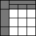

 

[Web Accessibility Tutorials Guidance on how to create websites that meet WCAG](../../)

<a href="#nav" class="btn btn-jump">Jump to the navigation</a>

[Tutorials home](../../) »  [Tables](../) » Current: Tables with irregular headers 

Tables with irregular headers
=============================

 This page covers tables with header cells that span multiple columns and/or rows. Several elements and attributes can be used to define the structure and relationships of the header and data cells.

For example, a header cell that spans three columns should be associated with corresponding data cells in the column group. This can be done by setting the `scope` attribute of the header cell to the value `colgroup`. The same principle applies to header cells spanning multiple rows. In this case, they are associated with by using the value `rowgroup` in the `scope` attribute.

However, before making these associations, the structure of such groups of columns and rows needs to be defined in the table markup:

-   A column group is defined using the `<colgroup>` element.
-   A row group is defined by the `<thead>`, `<tfoot>` and `<tbody>` elements.
    -   `<thead>` and `<tfoot>` elements can be used once in a table.
    -   A table can have any number of `<tbody>` elements that each defines a row group.

Table with two tier headers
---------------------------

In the table below, there are two pairs of column headers. Each pair of column headers, “Produced” and “Sold” is associated with a first-level header that identifies the pair: “Mars” and “Venus”. These first-level headers are made to span two columns by using the `colspan` attribute with the value of `2`.

The column structure needs to be defined at the beginning of the table to associate first-level headers correctly with all cells of both columns. A `<col>` element identifies each column, beginning on the left. If a header spans two or more columns, use a `<colgroup>` element instead of that number of `<col>` elements, and the number of columns spanned is noted in the `span` attribute.

Also, the value of the `scope` attribute in the first-level headers is set to `colgroup` so that it is associated with the entire group of columns. The second-level headers only apply to the corresponding column, so the `scope` attribute is set to `col` as shown in previous examples.

Example:

Mars

Venus

Produced

Sold

Produced

Sold

Teddy Bears

50,000

30,000

100,000

80,000

Board Games

10,000

5,000

12,000

9,000

Code snippet:

    <table>
      <col>
      <colgroup span="2"></colgroup>
      <colgroup span="2"></colgroup>
      <tr>
        <td rowspan="2"></td>
        <th colspan="2" scope="colgroup">Mars</th>
        <th colspan="2" scope="colgroup">Venus</th>
      </tr>
      <tr>
        <th scope="col">Produced</th>
        <th scope="col">Sold</th>
        <th scope="col">Produced</th>
        <th scope="col">Sold</th>
      </tr>
      <tr>
        <th scope="row">Teddy Bears</th>
        <td>50,000</td>
        <td>30,000</td>
        <td>100,000</td>
        <td>80,000</td>
      </tr>
      <tr>
        <th scope="row">Board Games</th>
        <td>10,000</td>
        <td>5,000</td>
        <td>12,000</td>
        <td>9,000</td>
      </tr>
    </table>

Note: A `<colgroup>` element can contain a `<col>` element to identify individual columns in the group. The combined sum of `<col>` elements (not contained in `<colgroup>` elements) and column elements indicated by the `span` attributes of the `<colgroup>` elements should be equal to the total number of columns in the table.

Table with headers spanning multiple rows or columns
----------------------------------------------------

In the example below, the table consists of two individual columns and one column group spanning three columns. It has six rows. Two headers that span multiple rows. To make sure that such header cells that span multiple rows are correctly associated with all the cells in those rows, the rows must be grouped. To define row groups wrap the corresponding rows in `<tbody>` elements (table body). Additionally, the `scope` attribute of header cells spanning rows has to be set to `rowgroup`.

If a header spans multiple header rows, wrap the rows in a `<thead>` element instead of a `<tbody>` element. Use a `<tfoot>` element if a header spans multiple rows in the footer area of a table.

Due to the complexity of the table a [summary technique](../caption-summary/) could be used to describe the layout of the table in detail.

Example:

Poster availability

Poster name

Color

Sizes available

Zodiac

Full color

A2

A3

A4

Black and white

A1

A2

A3

Sepia

A3

A4

A5

Angels

Black and white

A1

A3

A4

Sepia

A2

A3

A5

Code snippet:

    <table>
      <caption>
        Poster availability
      </caption>
      <col>
      <col>
      <colgroup span="3"></colgroup>
      <thead>
        <tr>
          <th scope="col">Poster name</th>
          <th scope="col">Color</th>
          <th colspan="3" scope="colgroup">Sizes available</th>
        </tr>
      </thead>
      <tbody>
        <tr>
          <th rowspan="3" scope="rowgroup">Zodiac</th>
          <th scope="row">Full color</th>
          <td>A2</td>
          <td>A3</td>
          <td>A4</td>
        </tr>
        <tr>
          <th scope="row">Black and white</th>
          <td>A1</td>
          <td>A2</td>
          <td>A3</td>
        </tr>
        <tr>
          <th scope="row">Sepia</th>
          <td>A3</td>
          <td>A4</td>
          <td>A5</td>
        </tr>
      </tbody>
      <tbody>
        <tr>
          <th rowspan="2" scope="rowgroup">Angels</th>
          <th scope="row">Black and white</th>
          <td>A1</td>
          <td>A3</td>
          <td>A4</td>
        </tr>
        <tr>
          <th scope="row">Sepia</th>
          <td>A2</td>
          <td>A3</td>
          <td>A5</td>
        </tr>
      </tbody>
    </table>

Note: Using `<thead>`, `<tbody>` and `<tfoot>` in every table, even if there are no headers spanning columns may avoid confusion on when to use them.

Related WCAG resources
----------------------

These tutorials provide best-practice guidance on implementing accessibility in different situations. This page combined the following WCAG success criteria and techniques from different conformance levels:

**Techniques:**

-   [H63: Using the scope attribute to associate header cells and data cells in data tables](https://www.w3.org/WAI/WCAG21/Techniques/html/H63)

-   [Previous:Two Headers](../two-headers/)
-   [Next:Multi-level Headers](../multi-level/)

We welcome your ideas
---------------------

Please send any ideas, suggestions, or comments to the [(publicly-archived) mailing list wai-eo-editors@w3.org](mailto:wai-eo-editors@w3.org?subject=%5BTutorial%20Feedback%5D). You can also contribute to the [code directly on Github](https://github.com/w3c/wai-tutorials).

<a href="https://github.com/w3c/wai-tutorials/blob/master/source/tables/irregular.html.erb.md" class="btn">Fork &amp; edit this page on Github</a>

Tables Tutorial
---------------

-   [Tables Concepts](../)
-   [One Header](../one-header/)
-   [Two Headers](../two-headers/)
-   Current: Irregular Headers
-   [Multi-level Headers](../multi-level/)
-   [Caption & Summary](../caption-summary/)
-   [Tips and Tricks](../tips/)

All Tutorials
-------------

-   [Page Structure](../../page-structure/)
-   [Menus](../../menus/)
-   [Images](../../images/)
-   Current: Tables
-   [Forms](../../forms/)
-   [Carousels](../../carousels/)

Document Information
--------------------

**Feedback: We welcome ideas for improvements, bug reports, and comments** via [GitHub](https://github.com/w3c/wai-tutorials) or e-mail to <wai-eo-editors@w3.org> (a publicly archived list) or <wai@w3.org> (a WAI staff-only list).

-   **Status:** Updated 27 July 2019 (first published September 2014)
-   Editors:
    -   [Eric Eggert](https://www.w3.org/People/yatil/)
    -   [Shadi Abou-Zahra](https://www.w3.org/People/shadi/)

    Contributors:
    -   The Web Content Accessibility Guidelines Working Group ([WCAG WG](https://www.w3.org/WAI/GL/))
    -   the Education and Outreach Working Group ([EOWG](https://www.w3.org/WAI/EO/))

-   Developed with support from the [WAI-ACT project](https://www.w3.org/WAI/ACT/), co-funded by the **European Commission IST Programme**.
-   \[[Attributions](../../attributions/)\] \[[Changelog](../../changelog/)\]

\[[WAI Site Map](https://www.w3.org/WAI/sitemap.html)\] \[[Help with WAI Website](https://www.w3.org/WAI/sitehelp.html)\] \[[Search](https://www.w3.org/WAI/search.php)\] \[[Contacting WAI](https://www.w3.org/WAI/contacts)\]

Copyright © 2019 W3C ® ([MIT](http://www.csail.mit.edu/), [ERCIM](http://www.ercim.eu/), [Keio](http://www.keio.ac.jp/), [Beihang](http://ev.buaa.edu.cn/)) [Usage policies apply](/Consortium/Legal/ipr-notice).

