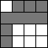

 

[Web Accessibility Tutorials Guidance on how to create websites that meet WCAG](../../)

<a href="#nav" class="btn btn-jump">Jump to the navigation</a>

[Tutorials home](../../) »  [Tables](../) » Current: Tables with multi-level headers 

Tables with multi-level headers
===============================

 This page covers tables that have multi-level header cells associated per data cell. Such tables are too complex to identify a strict horizontal or vertical association between header and data cells. In such tables, each table header is represented by a (document-wide) unique `id`. Data cells refer to those `id`s by listing one or more in their `headers` attribute, separated by spaces.

Tables that should be marked up this way include:

-   Tables with column headers that repeat or change part-way through the table.
-   Tables with three or more header cells associated with each data cell.

Tables with multiple headers may also need to have a caption to identify it and a summary to describe the layout of the table, see [Caption & Summary](../caption-summary/).

In many cases, it is worth considering to restructure the information in such tables to make them less complex for all readers, for example by splitting the information in smaller, more manageable tables as shown in [Example 3](#split-up-multi-level-tables).

Table with multiple column headers in each column
-------------------------------------------------

In the table below, the headers for the top half of the tables are different to the headers of the bottom half. The header changes halfway through the table which makes the headers in columns ambiguous. To ensure each data cell is associated with the correct header, each `<th>` element has a unique `id` and each `<td>` cell has a `headers` attribute that lists the `id` values of the associated header cells.

Example:

<table><caption> Supplier contacts </caption><thead><tr class="header"><th> </th><th>Example 1 Ltd</th><th>Example 2 Co</th></tr></thead><tbody><tr class="odd"><td>Contact</td><td>James Phillips</td><td>Marie Beauchamp</td></tr><tr class="even"><td>Position</td><td>Sales Director</td><td>Sales Manager</td></tr><tr class="odd"><td>Email</td><td>jp@1ltd.example.com</td><td>marie@2co.example.com</td></tr><tr class="even"><td> </td><td>Example 3 Ltd</td><td>Example 4 Inc</td></tr><tr class="odd"><td>Contact</td><td>Suzette Jones</td><td>Alex Howe</td></tr><tr class="even"><td>Position</td><td>Sales Officer</td><td>Sales Director</td></tr><tr class="odd"><td>Email</td><td>Suz@ltd3.example.com</td><td>howe@4inc.example.com</td></tr></tbody></table>

In the following code snippet, the headers for the header cells themselves have been set to an empty cell (with the `id` “blank”). This will prevent some assistive technologies from reading a header for those heading cells.

Code snippet: Assigning **id** attributes to `<th>` cells

    […]
    <td id="blank">&nbsp;</td>
    <th id="co1" headers="blank">Example 1 Ltd</th>
    <th id="co2" headers="blank">Example 2 Co</th>
    […]
    <th id="c1" headers="blank">Contact</th>
    […]

Code snippet: Assigning **header** attributes to `<td>` cells

    […]
    <td headers="co1 c1">James Phillips</td>
    <td headers="co2 c1">Marie Beauchamp</td>
    […]

[Full code for Example “Table with multiple column headers in each column”](../examples/multiplecolumnheaders/)

Table with three headers related to each data cell
--------------------------------------------------

In this example, table headers are used as subheadings to describe what the next section of the table is about. Without these headers, the information would be unclear. Using the `headers` attribute, all three headers can be properly associated with the data cell.

Example:

Availability of holiday accommodation

Studio

Apt

Chalet

Villa

Paris

1 bedroom

11

20

25

23

2 bedroom

\-

43

52

32

3 bedroom

\-

13

15

40

Rome

1 bedroom

13

21

22

3

2 bedroom

\-

23

43

30

3 bedroom

\-

16

32

40

Code snippet: Assigning `id` attributes to `<th>` cells

    […]
        <th id="par" colspan="5" scope="colgroup">Paris</th>
    </tr>
    <tr>
        <th id="pbed1">1 bedroom</th>
    […]

Code snippet: Assigning `header` attributes to `<td>` cells

    […]
    <td headers="par pbed1 stud">11</td>
    <td headers="par pbed1 apt"> 20</td>
    […]

[Full code for Example “Table with three headers related to each data cell”](../examples/threeheaders/)

Split up multi-level tables
---------------------------

The two tables below provide the same information as the mutli-level table in [the example above](#table-with-three-headers-related-to-each-data-cell). This makes the information easier to understand for everyone and easier to code. Also, simple tables are much better supported by tools to create web content, including WYSIWYG (“What you see is what you get”) editors.

Example:

**Availability of holiday accommodation**

<table><caption> Paris </caption><thead><tr class="header"><th></th><th>Studio</th><th>Apt</th><th>Chalet</th><th>Villa</th></tr></thead><tbody><tr class="odd"><td>1 bedroom</td><td>11</td><td>20</td><td>25</td><td>23</td></tr><tr class="even"><td>2 bedroom</td><td>-</td><td>43</td><td>52</td><td>32</td></tr><tr class="odd"><td>3 bedroom</td><td>-</td><td>13</td><td>15</td><td>40</td></tr></tbody></table>

<table><caption> Rome </caption><thead><tr class="header"><th></th><th>Studio</th><th>Apt</th><th>Chalet</th><th>Villa</th></tr></thead><tbody><tr class="odd"><td>1 bedroom</td><td>13</td><td>21</td><td>22</td><td>3</td></tr><tr class="even"><td>2 bedroom</td><td>-</td><td>23</td><td>43</td><td>30</td></tr><tr class="odd"><td>3 bedroom</td><td>-</td><td>16</td><td>32</td><td>40</td></tr></tbody></table>

Related WCAG resources
----------------------

These tutorials provide best-practice guidance on implementing accessibility in different situations. This page combined the following WCAG success criteria and techniques from different conformance levels:

**Techniques:**

-   [H43: Using id and headers attributes to associate data cells with header cells in data tables](https://www.w3.org/WAI/WCAG21/Techniques/html/H43)

-   [Previous:Irregular Headers](../irregular/)
-   [Next:Caption & Summary](../caption-summary/)

We welcome your ideas
---------------------

Please send any ideas, suggestions, or comments to the [(publicly-archived) mailing list wai-eo-editors@w3.org](mailto:wai-eo-editors@w3.org?subject=%5BTutorial%20Feedback%5D). You can also contribute to the [code directly on Github](https://github.com/w3c/wai-tutorials).

<a href="https://github.com/w3c/wai-tutorials/blob/master/source/tables/multi-level.html.erb.md" class="btn">Fork &amp; edit this page on Github</a>

Tables Tutorial
---------------

-   [Tables Concepts](../)
-   [One Header](../one-header/)
-   [Two Headers](../two-headers/)
-   [Irregular Headers](../irregular/)
-   Current: Multi-level Headers
-   [Caption & Summary](../caption-summary/)
-   [Tips and Tricks](../tips/)

All Tutorials
-------------

-   [Page Structure](../../page-structure/)
-   [Menus](../../menus/)
-   [Images](../../images/)
-   Current: Tables
-   [Forms](../../forms/)
-   [Carousels](../../carousels/)

Document Information
--------------------

**Feedback: We welcome ideas for improvements, bug reports, and comments** via [GitHub](https://github.com/w3c/wai-tutorials) or e-mail to <wai-eo-editors@w3.org> (a publicly archived list) or <wai@w3.org> (a WAI staff-only list).

-   **Status:** Updated 27 July 2019 (first published September 2014)
-   Editors:
    -   [Eric Eggert](https://www.w3.org/People/yatil/)
    -   [Shadi Abou-Zahra](https://www.w3.org/People/shadi/)

    Contributors:
    -   Anna Belle Leiserson
    -   the Web Content Accessibility Guidelines Working Group ([WCAG WG](https://www.w3.org/WAI/GL/))
    -   the Education and Outreach Working Group ([EOWG](https://www.w3.org/WAI/EO/))

-   Developed with support from the [WAI-ACT project](https://www.w3.org/WAI/ACT/), co-funded by the **European Commission IST Programme**.
-   \[[Attributions](../../attributions/)\] \[[Changelog](../../changelog/)\]

\[[WAI Site Map](https://www.w3.org/WAI/sitemap.html)\] \[[Help with WAI Website](https://www.w3.org/WAI/sitehelp.html)\] \[[Search](https://www.w3.org/WAI/search.php)\] \[[Contacting WAI](https://www.w3.org/WAI/contacts)\]

Copyright © 2019 W3C ® ([MIT](http://www.csail.mit.edu/), [ERCIM](http://www.ercim.eu/), [Keio](http://www.keio.ac.jp/), [Beihang](http://ev.buaa.edu.cn/)) [Usage policies apply](/Consortium/Legal/ipr-notice).

