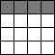

 

[Web Accessibility Tutorials Guidance on how to create websites that meet WCAG](../../)

<a href="#nav" class="btn btn-jump">Jump to the navigation</a>

[Tutorials home](../../) »  [Tables](../) » Current: Tables with one header 

Tables with one header
======================

 This page covers tables that have one simple header for rows **or** one simple header for columns. Data in such tables is descriptive on its own and unambiguous.

If the table content is ambiguous or has both column and row headings, the `scope` attribute should be used to avoid confusion. For more guidance on such tables, see [tables with two headers](../two-headers/).

Table with header cells in the top row only
-------------------------------------------

The following table of concerts has the cells in the first row marked up using the `<th>` element. This is only acceptable because it is such a small table and the data itself is distinctly different in each column so that the relationship between the header and data cells is evident.

**Note:** Some screen readers will read “Date – Event – Venue” in the “Venue” cell because the direction of the `<th>` elements is ambiguous.

Example:

**Concerts:**

<table><thead><tr class="header"><th>Date</th><th>Event</th><th>Venue</th></tr></thead><tbody><tr class="odd"><td>12 February</td><td>Waltz with Strauss</td><td>Main Hall</td></tr><tr class="even"><td>24 March</td><td>The Obelisks</td><td>West Wing</td></tr><tr class="odd"><td>14 April</td><td>The What</td><td>Main Hall</td></tr></tbody></table>

Code snippet:

    <table>
        <tr>
            <th>Date</th>
            <th>Event</th>
            <th>Venue</th>
        </tr>
        <tr>
            <td>12 February</td>
            <td>Waltz with Strauss</td>
            <td>Main Hall</td>
        </tr>
        […]
    </table>

Table with header cells in the first column only
------------------------------------------------

In the following table, the data from the previous example is laid out with the header column on the left. Also in this situation, it is only acceptable to use this code because it is such a small and straightforward table. The next pages in this tutorial explain how to code more complex tables.

Example:

**Concerts:**

<table><tbody><tr class="odd"><td>Date</td><td>12 February</td><td>24 March</td><td>14 April</td></tr><tr class="even"><td>Event</td><td>Waltz with Strauss</td><td>The Obelisks</td><td>The What</td></tr><tr class="odd"><td>Venue</td><td>Main Hall</td><td>West Wing</td><td>Main Hall</td></tr></tbody></table>

Code snippet:

    <table>
        <tr>
            <th>Date</th>
            <td>12 February</td>
            <td>24 March</td>
            <td>14 April</td>
        </tr>
        <tr>
            <th>Event</th>
            <td>Waltz with Strauss</td>
            <td>The Obelisks</td>
            <td>The What</td>
        </tr>
        <tr>
            <th>Venue</th>
            <td>Main Hall</td>
            <td>West Wing</td>
            <td>Main Hall</td>
        </tr>
    </table>

Table with ambiguous data
-------------------------

In this example, the data (first name, last name, and city) can’t be distinguished from one another without knowing which header each corresponds to. The `scope` attribute with the value `col` defines the direction of the header cells and associates them with the corresponding data cells. The `scope` attribute is also needed for larger tables with one header row or column.

Example:

<table><caption>Teddy bear collectors:</caption><thead><tr class="header"><th>Last Name</th><th>First Name</th><th>City</th></tr></thead><tbody><tr class="odd"><td>Phoenix</td><td>Imari</td><td>Henry</td></tr><tr class="even"><td>Zeki</td><td>Rome</td><td>Min</td></tr><tr class="odd"><td>Apirka</td><td>Kelly</td><td>Brynn</td></tr></tbody></table>

Code snippet:

    <table>
      <caption>Teddy bear collectors:</caption>
      <tr>
        <th scope="col">Last Name</th>
        <th scope="col">First Name</th>
        <th scope="col">City</th>
      </tr>
      <tr>
        <td>Phoenix</td>
        <td>Imari</td>
        <td>Henry</td>
      </tr>
      <tr>
        <td>Zeki</td>
        <td>Rome</td>
        <td>Min</td>
      </tr>
      <tr>
        <td>Apirka</td>
        <td>Kelly</td>
        <td>Brynn</td>
      </tr>
    </table>

Related WCAG resources
----------------------

These tutorials provide best-practice guidance on implementing accessibility in different situations. This page combined the following WCAG success criteria and techniques from different conformance levels:

**Techniques:**

-   [H51: Using table markup to present tabular data](https://www.w3.org/WAI/WCAG21/Techniques/html/H51)
-   [H63: Using the scope attribute to associate header cells and data cells in data tables](https://www.w3.org/WAI/WCAG21/Techniques/html/H63)

-   [Previous:Tables Concepts](../)
-   [Next:Two Headers](../two-headers/)

We welcome your ideas
---------------------

Please send any ideas, suggestions, or comments to the [(publicly-archived) mailing list wai-eo-editors@w3.org](mailto:wai-eo-editors@w3.org?subject=%5BTutorial%20Feedback%5D). You can also contribute to the [code directly on Github](https://github.com/w3c/wai-tutorials).

<a href="https://github.com/w3c/wai-tutorials/blob/master/source/tables/one-header.html.erb.md" class="btn">Fork &amp; edit this page on Github</a>

Tables Tutorial
---------------

-   [Tables Concepts](../)
-   Current: One Header
-   [Two Headers](../two-headers/)
-   [Irregular Headers](../irregular/)
-   [Multi-level Headers](../multi-level/)
-   [Caption & Summary](../caption-summary/)
-   [Tips and Tricks](../tips/)

All Tutorials
-------------

-   [Page Structure](../../page-structure/)
-   [Menus](../../menus/)
-   [Images](../../images/)
-   Current: Tables
-   [Forms](../../forms/)
-   [Carousels](../../carousels/)

Document Information
--------------------

**Feedback: We welcome ideas for improvements, bug reports, and comments** via [GitHub](https://github.com/w3c/wai-tutorials) or e-mail to <wai-eo-editors@w3.org> (a publicly archived list) or <wai@w3.org> (a WAI staff-only list).

-   **Status:** Updated 27 July 2019 (first published September 2014)
-   Editors:
    -   [Eric Eggert](https://www.w3.org/People/yatil/)
    -   [Shadi Abou-Zahra](https://www.w3.org/People/shadi/)

    Contributors:
    -   The Web Content Accessibility Guidelines Working Group ([WCAG WG](https://www.w3.org/WAI/GL/))
    -   the Education and Outreach Working Group ([EOWG](https://www.w3.org/WAI/EO/))

-   Developed with support from the [WAI-ACT project](https://www.w3.org/WAI/ACT/), co-funded by the **European Commission IST Programme**.
-   \[[Attributions](../../attributions/)\] \[[Changelog](../../changelog/)\]

\[[WAI Site Map](https://www.w3.org/WAI/sitemap.html)\] \[[Help with WAI Website](https://www.w3.org/WAI/sitehelp.html)\] \[[Search](https://www.w3.org/WAI/search.php)\] \[[Contacting WAI](https://www.w3.org/WAI/contacts)\]

Copyright © 2019 W3C ® ([MIT](http://www.csail.mit.edu/), [ERCIM](http://www.ercim.eu/), [Keio](http://www.keio.ac.jp/), [Beihang](http://ev.buaa.edu.cn/)) [Usage policies apply](/Consortium/Legal/ipr-notice).

