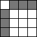

 

[Web Accessibility Tutorials Guidance on how to create websites that meet WCAG](../../)

<a href="#nav" class="btn btn-jump">Jump to the navigation</a>

[Tutorials home](../../) »  [Tables](../) » Current: Tables with two headers 

Tables with two headers
=======================

 This page covers tables that have a simple row header and a simple column header. In such tables, the relationship between the headers and data cells becomes quickly ambiguous. For such tables, use the `<th>` element to identify the header cells and the `scope` attribute to declare the direction of each header. The `scope` attribute can be set to `row` or `col` to denote that a header applies to the entire row or column, respectively.

Additionally, you can use the `<caption>` element to identify the table in a document. This is particularly useful for screen-reader users browsing the web page in “table mode” where they can navigate from table to table. More background and guidance on the using `<caption>` element is provided on the [Caption & Summary page](../caption-summary/).

Table with header cells in the top row and first column
-------------------------------------------------------

The following table of opening times has header information in both the top row and the first column. All header cells are marked up as `<th>` cells with `scope` attributes added.

In the header row, the `col` value for `scope` associates each header cell with the data cells in the column. In the header column, the `row` value associates the individual headers with their rows. Without this information, some users would not easily understand the relationship between header and data cells. In the example below, the “Open” and “Closed” labels are only useful if they can be assigned to a particular day and time.

Example:

<table><caption>Delivery slots:</caption><tbody><tr class="odd"><td></td><td>Monday</td><td>Tuesday</td><td>Wednesday</td><td>Thursday</td><td>Friday</td></tr><tr class="even"><td>09:00 - 11:00</td><td>Closed</td><td>Open</td><td>Open</td><td>Closed</td><td>Closed</td></tr><tr class="odd"><td>11:00 - 13:00</td><td>Open</td><td>Open</td><td>Closed</td><td>Closed</td><td>Closed</td></tr><tr class="even"><td>13:00 - 15:00</td><td>Open</td><td>Open</td><td>Open</td><td>Closed</td><td>Closed</td></tr><tr class="odd"><td>15:00 - 17:00</td><td>Closed</td><td>Closed</td><td>Closed</td><td>Open</td><td>Open</td></tr></tbody></table>

Code snippet:

    <table>
      <caption>Delivery slots:</caption>
      <tr>
        <td></td>
        <th scope="col">Monday</th>
        <th scope="col">Tuesday</th>
        <th scope="col">Wednesday</th>
        <th scope="col">Thursday</th>
        <th scope="col">Friday</th>
      </tr>
      <tr>
        <th scope="row">09:00 - 11:00</th>
        <td>Closed</td>
        <td>Open</td>
        <td>Open</td>
        <td>Closed</td>
        <td>Closed</td>
      </tr>
      <tr>
        <th scope="row">11:00 - 13:00</th>
        <td>Open</td>
        <td>Open</td>
        <td>Closed</td>
        <td>Closed</td>
        <td>Closed</td>
      </tr>
      […]
    </table>

[Full code for “Table with header cells in the top row and first column”](../examples/headertoprowfirstcol/)

Table with an offset column of header cells
-------------------------------------------

In this table, the row header cells are in the second rather than in the first column. The approach is similar to the examples above: The scope of the header cells in the top row is set to `col`. By using the `row` value for `scope` assigns the header cells in the second column to the data cells on the left and the right of the individual header cell.

Example:

<table><caption> Holidays taken in the last six months </caption><thead><tr class="header"><th>ID</th><th>Name</th><th>July</th><th>August</th><th>September</th><th>October</th><th>November</th><th>December</th></tr></thead><tbody><tr class="odd"><td>215</td><td>Abel</td><td>5</td><td>2</td><td>0</td><td>0</td><td>0</td><td>3</td></tr><tr class="even"><td>231</td><td>Annette</td><td>0</td><td>5</td><td>3</td><td>0</td><td>0</td><td>6</td></tr><tr class="odd"><td>173</td><td>Bernard</td><td>2</td><td>0</td><td>0</td><td>5</td><td>0</td><td>0</td></tr><tr class="even"><td>141</td><td>Gerald</td><td>0</td><td>10</td><td>0</td><td>0</td><td>0</td><td>8</td></tr><tr class="odd"><td>99</td><td>Michael</td><td>8</td><td>8</td><td>8</td><td>8</td><td>0</td><td>4</td></tr></tbody></table>

Code snippet:

    […]
    <tr>
      <td>215</td>
      <th scope="row">Abel</th>
      <td>5</td>
      <td>2</td>
      <td>0</td>
      <td>0</td>
      <td>0</td>
      <td>3</td>
    </tr>
    […]

[Full code for “Table with an offset column of header cells”](../examples/scope-offset/)

Related WCAG resources
----------------------

These tutorials provide best-practice guidance on implementing accessibility in different situations. This page combined the following WCAG success criteria and techniques from different conformance levels:

**Techniques:**

-   [H51: Using table markup to present tabular data](https://www.w3.org/WAI/WCAG21/Techniques/html/H51)
-   [H63: Using the scope attribute to associate header cells and data cells in data tables](https://www.w3.org/WAI/WCAG21/Techniques/html/H63)

-   [Previous:One Header](../one-header/)
-   [Next:Irregular Headers](../irregular/)

We welcome your ideas
---------------------

Please send any ideas, suggestions, or comments to the [(publicly-archived) mailing list wai-eo-editors@w3.org](mailto:wai-eo-editors@w3.org?subject=%5BTutorial%20Feedback%5D). You can also contribute to the [code directly on Github](https://github.com/w3c/wai-tutorials).

<a href="https://github.com/w3c/wai-tutorials/blob/master/source/tables/two-headers.html.erb.md" class="btn">Fork &amp; edit this page on Github</a>

Tables Tutorial
---------------

-   [Tables Concepts](../)
-   [One Header](../one-header/)
-   Current: Two Headers
-   [Irregular Headers](../irregular/)
-   [Multi-level Headers](../multi-level/)
-   [Caption & Summary](../caption-summary/)
-   [Tips and Tricks](../tips/)

All Tutorials
-------------

-   [Page Structure](../../page-structure/)
-   [Menus](../../menus/)
-   [Images](../../images/)
-   Current: Tables
-   [Forms](../../forms/)
-   [Carousels](../../carousels/)

Document Information
--------------------

**Feedback: We welcome ideas for improvements, bug reports, and comments** via [GitHub](https://github.com/w3c/wai-tutorials) or e-mail to <wai-eo-editors@w3.org> (a publicly archived list) or <wai@w3.org> (a WAI staff-only list).

-   **Status:** Updated 27 July 2019 (first published September 2014)
-   Editors:
    -   [Eric Eggert](https://www.w3.org/People/yatil/)
    -   [Shadi Abou-Zahra](https://www.w3.org/People/shadi/)

    Contributors:
    -   Andrew Kirkpatrick
    -   the Web Content Accessibility Guidelines Working Group ([WCAG WG](https://www.w3.org/WAI/GL/))
    -   the Education and Outreach Working Group ([EOWG](https://www.w3.org/WAI/EO/))

-   Developed with support from the [WAI-ACT project](https://www.w3.org/WAI/ACT/), co-funded by the **European Commission IST Programme**.
-   \[[Attributions](../../attributions/)\] \[[Changelog](../../changelog/)\]

\[[WAI Site Map](https://www.w3.org/WAI/sitemap.html)\] \[[Help with WAI Website](https://www.w3.org/WAI/sitehelp.html)\] \[[Search](https://www.w3.org/WAI/search.php)\] \[[Contacting WAI](https://www.w3.org/WAI/contacts)\]

Copyright © 2019 W3C ® ([MIT](http://www.csail.mit.edu/), [ERCIM](http://www.ercim.eu/), [Keio](http://www.keio.ac.jp/), [Beihang](http://ev.buaa.edu.cn/)) [Usage policies apply](/Consortium/Legal/ipr-notice).

